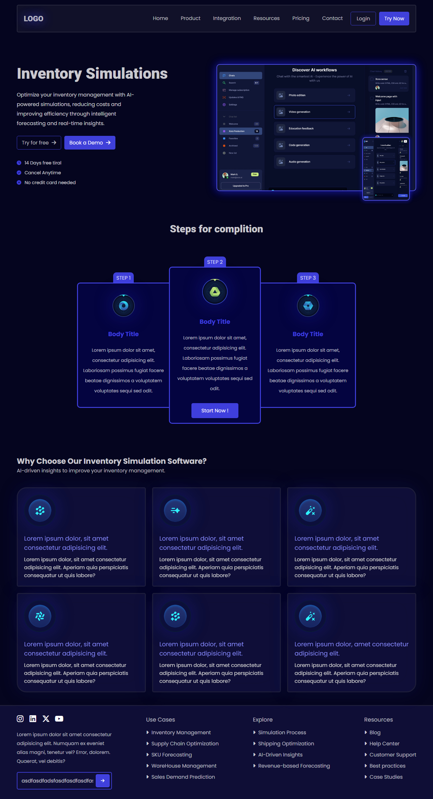

<!-- template for any project  -->

<!-- image of the project  -->

# Minimalist UI

This is a website design for freelancer.com contest. This project mainly focuses on the UI. it's modern coloring, designing & functionality makes it stand out from the rest. You can also get Designs like this by contacting me

---

**Live Demo** : [https://minimalist-web-design.vercel.app/](https://minimalist-web-design.vercel.app/)

---

**Total Time spent:** 1 day

**Builder:** [Abdullah Al Noman](https://github.com/Abdullahal2010)

**Freelancer Account:** [Mohammad Harun](https://www.freelancer.com/u/paramedicsharun)

**Usage:** End of this readme file

---

### Technologies Used

1. HTML
2. CSS
3. React.js
4. Vite.js
5. Git & github - _for source control_

---

### Contest Information.

Contest Link : [Minimalist UI/UX Design for Web App.](https://www.freelancer.com/contest/minimalist-uiux-design-for-web-app-2467477)

- Price: $250 AUD
- Time: 1 week.

---

## How to use this project

To use this Project First fork this repository or clone it to your local machine.

clone: `git clone https://github.com/Abdullahal2010/Minimalist-UI-For-Web-App.git`

After clonning move to the folder

`cd Minimalist-UI-For-Web-App`

Then install all packages by running

`npm install`

Then run

`npm run dev`

**Boom you can now see my creation**

---

&copy; Abdullah Al Noman 2024

- creative commons license

---
